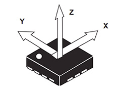
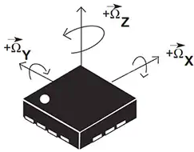
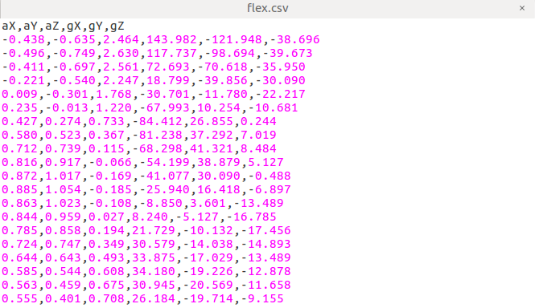
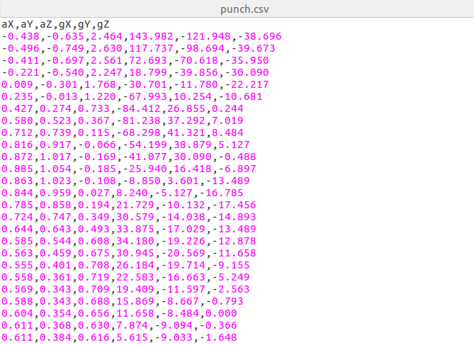

# tinyml-on-the-edge
Arduino nano 33 ble sense can be used to recognize gesture using machine learning. A tensorflow model is designed, built and trained using inertia sensors data on google colaboratory. Later the model is converted to tensorflow-lite model nano hardware can use as header file. The sensors include accelerometer sensor, gyroscope and magnetometer. In this work we are going to use accelerometer and gyroscope data to predict Sitting and standing body gesture. This is based on [arduino tutorials](https://github.com/arduino/ArduinoTensorFlowLiteTutorials).

This mini project will conform to the following procedure.
1. Revisit [setting up arduino IDE](https://github.com/billiyz/nano-33-ble-sense) without going through the programming part on sensor data collection.
2. Look into accelerometer and gyroscope operation
3. Write a sketch to collect accelerometer and gyroscope sensors data
4. Upload the data to the google colaboratory platform
5. Train a neural
6. Convert the model into tensorflow lite model
7. Encode the model in arduino header file

# Look into accelerometer, gyroscope operation.
IMU sensor on the arduino nano 33 ble sense has three sensors; accelerometer, gyroscope and magretometer. These sensors measure forces acting on a body. They give acceleration and rotation information. 

Many accelerometers and gyroscopes are fabricated using micro-electromechanical systems (MEMS). The production process for the MEMS sensor combines silicon and mechanical functions on the same micrometer silicon substrate. The major components in these devices are the mechanical elements, the sensing mechanism and the application specific integrated circuit (ASIC) as explained in [digi-key](https://www.digikey.com/en/articles/techzone/2018/jan/apply-sensor-fusion-to-accelerometers-and-gyroscopes)

## Application
* Phones
* Drones
* Aeroplanes
* Mobile IoT devices
* Anti- theft/asset tracking/security devices

## Operation 

### Accelerometer
In IMU 3d accelerometer sensor, the sensing mechanism for all three accelerometers is capacitive. The accelerometer measures linear acceleration along the x, y, and z axis. It has three sensors. The three sensors are mounted orthogonally. 

### Gyroscope
The gyroscpe measures the rate of change of angular velocity over time (angular changes). Many of these sensors are MEMS. Gyroscope also relies on the varying capacitance between silicon and mechanical elements, but with this configuration, the sensor generates capacitive changes with angular velocity changes. A 3d gyroscope also has 3 gyroscopic sensors mounted orthogonally to each other.

# Write a sketch to collect accelerometer and gyroscope sensors data
To capture the accelerometer and gyroscope data, A sketch is written on arduino IDE and uploaded to the board, or go to [arduinoTensorFlowLite Tutorials](https://github.com/arduino/ArduinoTensorFlowLiteTutorials) for the sketh. The sketch in this repos is labelled nano-33-gesture. Set up Arduino IDE. It aid in both uploading inference models to nano 33 board as well as download training data from it in .csv format. Incase you havent installed and configured your IDE, please check the repository on installing desktop IDE.

Plug the arduino nano 33 ble sense board to the computer, select the board and the port. Arduino boards run small applications (also called sketches) which are compiled from .ino format Arduino source code, and programmed onto the board using the Arduino IDE or Arduino Create. So lets collect the training data.

## Reading sensors data on the serial monitor
Open file, click New and save the sketch as nan0-33-gesture. There is a filter that performs signal preprocessing and filtering on the device before the data is output to the log. The skech does the following;

1. Detect motion using accelerometer and gyroscope and visualize
2. Trigger a sample window on detecting significant linear acceleration of the board
3. Sample the data every second at a frequency 119Hz
4. Format a CSV dataoutput via serial (COM1)

When done writing your scketch, save. Go to Sketch, and click upload. The sketch will indicate Done uploading. Turn to Tools. and click Serial Monitor to see the accelerometer and gyroscope data. you can as well plot on serial plot. However, Our objective to to have our data in .csv format to be used to train a model.
 

Make sure at the top of the serial monitor you have aX,aY,aZ,gX,gY,gZ. With thr arduino nano 33 ble sense in your hand, make a fist to signify a punch. Stretch the hand with the punch pointing the computer. Do that 20 times. Go to the Serial monitor and uncheck Autoscrol tab and copy the data. save the data on your pc as **punch.csv**. Flex your hand from the screen to your body 20 times too. Go to the serial monitor and copy the data again, but this time save as **flex.csv** on your PC.

# Upload the data to the google colaboratory platform

Open [google Colaboratory platorm](https://colab.research.google.com/drive/1uefbFF_D5cxqgREjxsKVwR9kD4K7tjtZ#scrollTo=Y2gs-PL4xDkZ), Move to Files. Drag and drop your **punch.csv** and **flex.csv** files in the sample_data folder. The google colab provides a Jupyter notebook that allows us to run our TensorFlow training in a web browser.

# Train a neural network, build and train a model 
While on the google colab, go trough the notebook till the end. Convertion the model into tensorflow lite model is done near the end. Ehe the when the **model.h** is created. click on the **model.h** file to download to your pc. If you open the model.h file, it will look like the one below.

# Encode the model in arduino header file

Open our accelerometer and gyroscope clasifier sketch on the repository, created by Don Coleman, Sandeep Mistry and modified by Dominic Pajak, Sandeep Mistry. On the far top right, click on the frop down button and click New Tab and name the file as **model.h**. Open the file and copy whatever was from the **model.h** you downloaded and paste in your new **model.h** file and save. Upload the sketch and turn to serial monitor to view the classification process. The confidence of each gesture will be printed to the Serial Monitor (0 = low confidence, 1 = high confidence)

 

Thank you.

 

